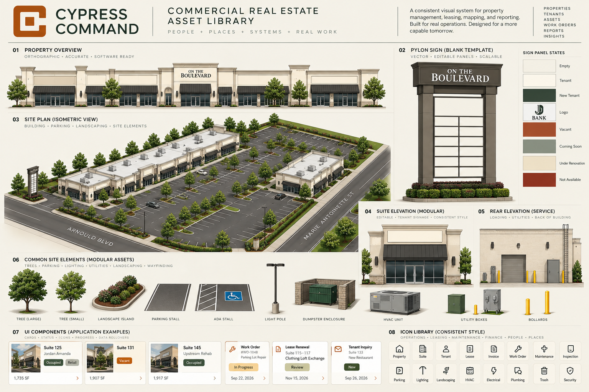

# Reference authority and provenance

## Current visual north star

`cypress-command-cre-asset-library-master-board.png` is the latest generated CRE board recovered from [Blank Pylon Sign Design](https://chatgpt.com/c/6a205d51-5ac0-8327-8619-c26e923a6d08). It follows the user's request “give another example using the referenced images for the design of cypress command” and precedes “so i drop this into the otb command repo?”. The live image viewer identified it as **Generated image 4**. Retrieved 2026-09-29; the file was copied without editing from the downloaded PNG. Its exact generation timestamp is not asserted.

The bounded conversation export omitted generated assistant images but exposed nine user attachments. The current board was therefore recovered through the original chat's visible image viewer, rather than substituted with one of those older attachments. `reference-manifest.json` records original filenames, roles, dimensions and SHA-256 hashes.

This is visual authority only. The depicted frontage, parcel/site shape, parking counts, panel geometry, road labels, suite numbers, areas, tenant names/logos, dates, occupancy and work-order examples are **unverified generated content**. Do not transcribe them into the property model. Do not use the board as a survey, floor plan, construction drawing or installed-equipment record.

## Supporting references

| File | Role and boundary |
| --- | --- |
| `cypress-command-light-master.png` | Supporting warm editorial hierarchy and semantic action/success/watch/stop rules |
| `cypress-command-dark-master.png` | Supporting theme adaptation with stable semantics |
| `brand-reference/cypress-command-applications-light.png` | Supporting composition/type/application examples; sample business data unverified |
| `brand-reference/cypress-command-applications-dark.png` | Supporting dark application examples; not a replacement for current CRE board |
| `brand-reference/cypress-command-logo-horizontal.jpg` | Existing mark/wordmark reference; locate approved vector master in repo |
| `brand-reference/cypress-command-logo-stacked.jpg` | Existing mark/wordmark reference; preserve rather than redesign |

Of the nine attachment images, the two AI Playbook-related boards are omitted because they are secondary to the supplied Cypress application/master references; the second similar light application board is also omitted. This leaves six supporting files plus the recovered current CRE board. Retained images remain byte-for-byte copies of the retrieved source files. Fonts, native logo vectors, CAD, scans and production property data are not bundled.

## Updating the reference

Keep prior reference versions and their provenance. A new current board requires an explicit source identity/selection, hash, scope and recorded supersession. Update the manifest and style spec together. Do not pick a newer local filename or an attractive alternative automatically. Preserve the current mark and semantic brand roles unless an explicit change is approved. Geometry authority remains with measured sources regardless of which visual reference is selected.
