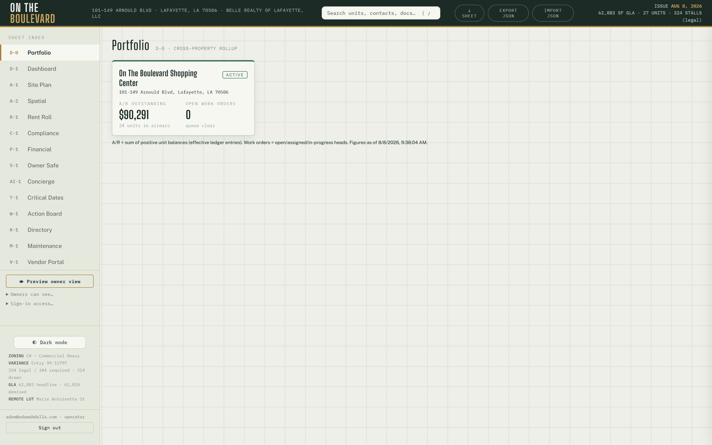
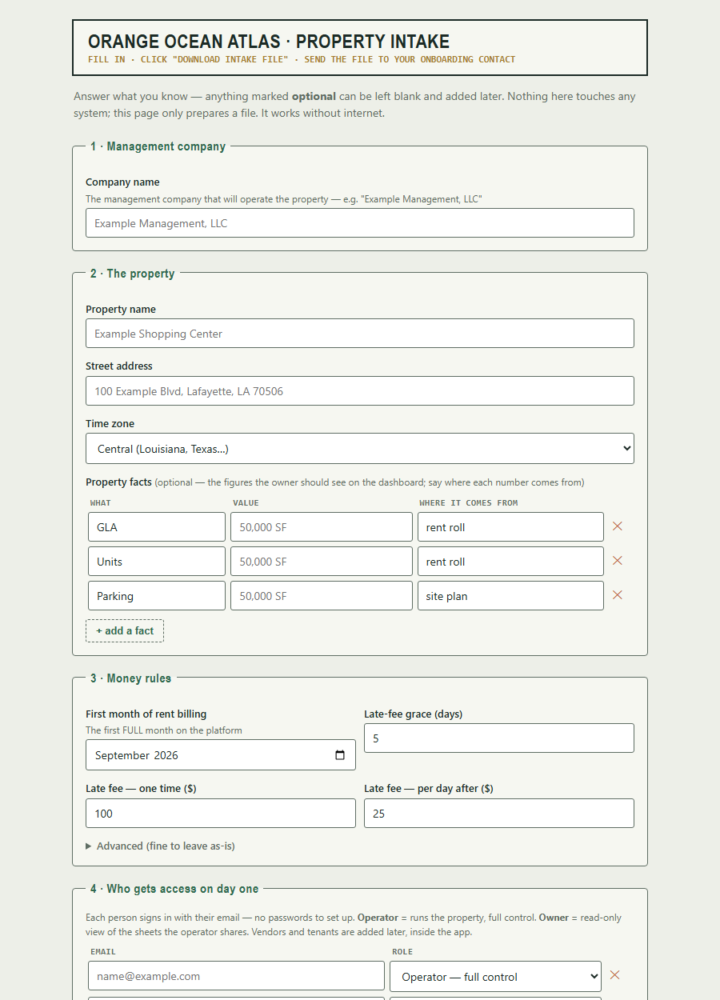
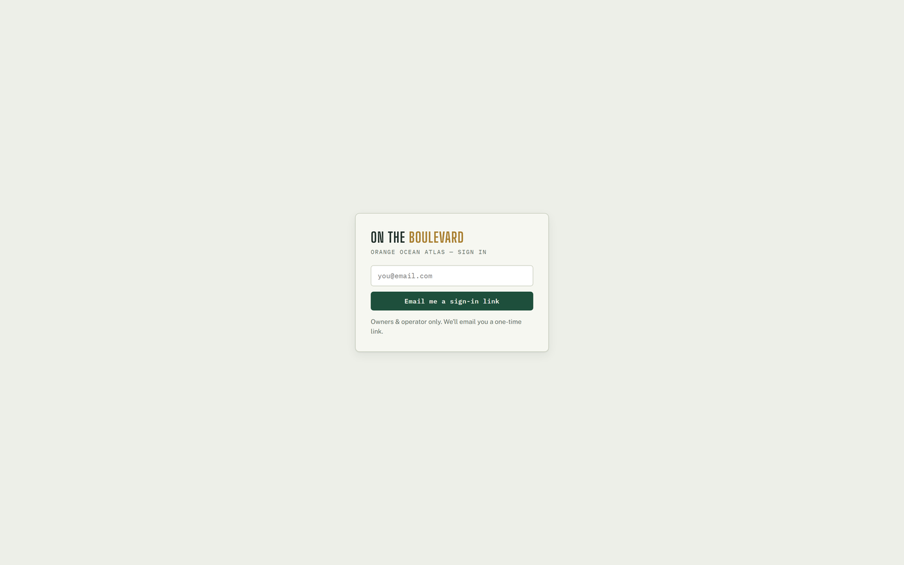

# Orange Ocean Atlas — Property Onboarding Manual
**Version August 2026 · the Phase C-1 rail, funnel-proven by the C-2 live run**
Operator-driven by design — there is no self-serve signup. One intake file =
one property.

This is the complete procedure for bringing a new property onto the platform:
what to collect, how to build the intake file, how to run it (dry, then live),
how to verify the result, and what the new property's people do next. It ends
with the deliberate v1 fences and the teardown procedure.

---

# 1. What onboarding does

A successful run creates, in one all-or-nothing transaction:

1. **The organization** (management company) — or reuses it by slug if it
   already exists, so a second property lands under the same org.
2. **The property** — slug, name, address, timezone, plus a `facts` list
   (label/value/source rows that dashboard-class cards derive from).
3. **The property settings row** — ledger start month, renewal horizon,
   occupancy floor, late-fee schedule, and a free-form SOP settings object.
4. **The authorized-email list** — email + role rows. No user accounts are
   forged: each person becomes real the first time they magic-link in, and
   the membership lattice assigns their role automatically.

The moment it lands, the property appears as a card on **D-0 Portfolio**, and
— at two or more visible properties — the **property switcher** appears in
the sidebar for every org-wide member. Nothing else changes: rent posting and
API surfaces keep serving the default property until the new one is
deliberately activated.



# 2. What to collect before you start (intake checklist)

**Org (management company)**
- Slug (lowercase, hyphens — permanent, choose once) and display name.
- Brand kit if available (palette / wordmark / contact block) — may start
  empty `{}`.

**Property**
- Slug (permanent), display name, street address, IANA timezone
  (e.g. `America/Chicago`).
- Facts worth surfacing: GLA, unit count, parking (with source citations —
  "rent roll 2026-08", "site plan"…). Facts are display rows, not schema;
  add what the owner will want to see.

**Settings**
- `ledger_start_ym` (`YYYY-MM`) — the first month rent charges will post.
  Choose the first FULL month on the platform; historical balances are a
  data-package concern, not an onboarding concern.
- `renewal_horizon_days` (default 180), `occupancy_floor` (default 0.85),
  late-fee schedule (`late_grace_days` / `late_flat` / `late_per_day`).
- SOP answers (emergency policy, vendor rules …) — free jsonb under
  `settings.settings`.

**People**
- Every email that should have access on day one, each tagged with a role:
  `operator` (full control) or `owner` (read-only, operator-curated sheets).
  Vendors and tenants are NOT onboarding rows — they come later through the
  vendor roster and tenant-login editor inside the app.

# 3. Build the intake file

## The easy way — the intake form (no technical knowledge needed)



Send the new property's manager **`docs/phase-c/intake-form.html`** (email the
file, or a Drive link — it opens in any browser and needs no internet). They
answer plain-English questions — company name, property name and address,
first billing month, late-fee schedule, who gets access — then click
**⤓ Download intake file** and send back the resulting
`intake-<property>.json`. The form checks its own answers as they go
(problems appear in plain English), auto-derives the permanent slugs from the
names, and cannot produce a file the validator would reject. It only prepares
the file — nothing is created until you run the rail in §4–5.

Anything they skip (facts, notes) you can add to the JSON afterward; their
free-text notes arrive under `settings.settings.intake_notes` for you to
translate into real SOP settings.

## The technical way — edit the JSON directly

Copy the template and fill it in:

```
docs/phase-c/onboarding-intake-template.json   →   docs/phase-c/intake-<slug>.json
```

```json
{
  "org": {
    "slug": "example-mgmt",
    "name": "Example Management, LLC",
    "brand": {}
  },
  "property": {
    "slug": "example-center",
    "name": "Example Shopping Center",
    "address": "100 Example Blvd, Lafayette, LA 70506",
    "tz": "America/Chicago",
    "facts": [
      { "label": "GLA", "value": "50,000 SF", "source": "rent roll 2026-08" },
      { "label": "Parking", "value": "250 spaces", "source": "site plan" }
    ]
  },
  "settings": {
    "ledger_start_ym": "2026-09",
    "renewal_horizon_days": 180,
    "occupancy_floor": 0.85,
    "late_grace_days": 5,
    "late_flat": 100,
    "late_per_day": 25,
    "settings": {}
  },
  "authorized": [
    { "email": "operator@example.com", "role": "operator" },
    { "email": "owner@example.com", "role": "owner" }
  ]
}
```

Rules the validator enforces (the tool refuses to touch the database on any
error): slug shape, timezone shape, `YYYY-MM` ledger start, role whitelist,
fact and authorized row shapes. Reusing an existing org slug is legitimate
(that is how a portfolio grows); reusing an existing **property** slug under
the same org is refused.

# 4. Dry-run

```bash
node tools/onboard-property.mjs docs/phase-c/intake-<slug>.json --dry-run
```

Validates the file and prints the full plan — org reuse vs create, the
property row, settings, and authorized emails — without any database contact.
Fix anything wrong and re-run until the plan reads exactly like the deal.

# 5. Live run

The live run uses the standard CRON_SECRET pull-load-delete drill (the secret
is pulled from Vercel env for the moment of use — never typed into chat,
never left on disk):

```bash
node tools/onboard-property.mjs docs/phase-c/intake-<slug>.json
```

The RPC is all-or-nothing: any failure rolls the entire intake back. A
**duplicate property raises** (`P0001`) and clobbers nothing — this is the
protection, not an error to work around.

# 6. Verify (two minutes)

**In the app** (as an org-wide member):
1. **D-0 Portfolio** shows the new property's card ($0 A/R, 0 work orders —
   correct for an empty property).
2. The **property switcher** now renders in the sidebar (it appears only at
   two or more visible properties).
3. Switch to the new property — every sheet boots **empty**. That is
   correct: a fresh property has no data package (§8).

**In SQL** (Supabase console), if you want belt-and-suspenders:

```sql
select p.slug, p.name, p.created_at, s.ledger_start_ym
from properties p join property_settings s on s.property_id = p.id
order by p.created_at;

select email, role from authorized_emails order by email;
```

**Financial isolation:** the rent cron posts only to the default property;
`api/*` still resolves the flagship. A newly onboarded property cannot create
financial side effects until it is deliberately given a data package and
activated.

# 7. First sign-ins

Send each authorized person to the login page — they enter their email and
click the magic link; their membership row and role materialize on first
sign-in. Nothing to provision, no passwords to distribute.



- The new **operator** lands with full control of their (empty) property.
- **Owners** land read-only on the operator-curated sheet set.
- Anyone not on the authorized list lands on the pending screen with no
  data access — promote or ignore from the sidebar's access panel.

# 8. The v1 fences (deliberate — do not fight them)

1. **No data package.** Onboarding creates the container, not the contents:
   units, geometry, rent roll, and seeds are the site-plan-tier premium step
   (Phase C data-package pipeline). Until that lands for the new property,
   the 13 property sheets remain bound to the flagship's bundled data — the
   new property renders correctly on D-0 and boots its own sheets empty.
2. **Known residual while switched:** manual edits made while you are
   actively switched INTO a data-less property will sync to that property.
   Don't do data entry on a property that hasn't had its package built.
3. **No storage folder prefixes yet** — the decision is deferred until the
   first real pilot's document volume makes the shape obvious.
4. **No self-serve UI.** Governed, operator-driven onboarding is the
   deliberate wedge; a UI can wrap this rail later without changing it.

# 9. Teardown (removing a property)

The C-2 proof property was created and torn down cleanly with this exact
pattern. Order matters (children first), and this is irreversible — read
twice, run once:

```sql
-- any typed-layer/child rows first (comp_state, board_state, …), then:
delete from property_settings
 where property_id = (select id from properties where slug = '<slug>');
delete from properties where slug = '<slug>';
```

Then verify: D-0 shows one card fewer; the switcher disappears if only one
property remains; the flagship's data is untouched.

# 10. Troubleshooting

| Symptom | Meaning | Do |
|---|---|---|
| Validator errors on dry-run | Intake file shape is wrong | Fix the listed fields; nothing was sent |
| `P0001` duplicate raise on live run | Property slug already exists under that org | This is the no-clobber guard. Pick a new slug, or tear down the old property first |
| New property card missing on D-0 | Viewer is not an org-wide member | Check the viewer's membership; org-wide members see all properties |
| Switcher not visible | Only one property is visible to you | Correct at one property — it renders at two or more |
| Sheets look like the flagship after switching | You are looking at bundled flagship data | Expected until the property's own data package exists (§8) |
| Someone stuck on "pending" | Email wasn't in `authorized`, or typo'd | Add/fix via the sidebar access panel; they re-click a fresh magic link |

---

*Provenance: intake contract and rail design `docs/phase-c/01-onboarding-design.md`;
validation seam `src/lib/onboard.js`; RPC migration `onboarding_rpc`; driver
`tools/onboard-property.mjs`. The rail was smoke-tested under rollback on
prod and funnel-proven live by the C-2 run (property created via the rail,
verified, then torn down).*
