# Cypress Command Platform — Operating Manual (On The Boulevard deployment)
**Version September 22, 2026 · covers the 18-sheet production build (777 tests)**
Live app: https://otb.cypresscommand.com (also orangeoceanatlas.com · otb-command.vercel.app) · Operator: adam@adamabdalla.com

This supersedes the July 2026 text-only edition (`docs/pitch/operator-manual.md`).
Every screenshot is a real capture of the running system. **Tenant names and
dollar figures shown are representative sample data, not actual tenancy or
economics.** Part I is orientation, Part II
is the operator's day, Part III covers each sheet in depth, Part IV is the
counterparty guides (owner / vendor / tenant / signer), Part V is the monthly
and periodic rhythms, Part VI is administration and recovery.

---

# Part I — Orientation

## 1.1 Signing in


There are no passwords. Enter your email on the login screen; a **magic link**
arrives by email; clicking it signs you in. Your role is resolved
automatically:

| You are… | How the system knows | You land on |
|---|---|---|
| Operator | adam@adamabdalla.com | Everything |
| Owner | pre-authorized email (see §6.1) | Read-only, operator-chosen sheets |
| Vendor | email matches the vendor roster | V-1 Vendor Portal only |
| Tenant | email in the tenant-contacts list | M-1 Maintenance only, own unit |
| Anyone else | — | A "pending" holding screen; no data |

If a legitimate person lands in pending, the operator promotes them (§6.1).

## 1.2 The drawing-set metaphor
The left sidebar is a **sheet index**, like an architect's drawing set:

- **D-0 Portfolio** — cross-property rollup (one card per property)
- **D-1 Dashboard** — KPIs, action queue, live cards
- **A-1 Site Plan** — the interactive plat
- **A-2 Spatial** — the property workspace (plat model, suite inspector, evidence) + capture lenses
- **R-1 Rent Roll** · **C-1 Compliance** · **P-1 Financial** — money and obligations
- **S-1 Owner Safe** — sealed document vault + property records
- **AI-1 Concierge** — the three AI personas
- **T-1 Critical Dates** · **W-1 Action Board** — what is due, who is doing it
- **K-1 Directory** — contacts, document register, pylon sign, site imagery
- **B-1 Marketing** — flyers, overview, tenant cards, photo library, tour media
- **L-1 Comm Log** — every letter, e-mail, meeting note and phone call
- **N-1 Matters** — long-running affairs with deadlines and correspondence
- **M-1 Maintenance** — work orders (also the tenant's sheet)
- **O-1 Operations** — the procedures (SOP) library
- **V-1 Vendor Portal** — vendor roster, COIs, work orders

The masthead carries a **KPI ribbon** — Occupancy · Rent/mo · Vacant · Expiring ≤12 mo ·
Needs attention — and each figure is a button that drills into its sheet.

The URL tracks the open sheet (`#roll`, `#plan`…) — the back button walks your
history, and links can deep-link a sheet. Boot lands on D-1 (D-0 sits above it
in drawing-set order but is a rollup, not the daily surface).

## 1.3 The unit drawer — the universal detail surface

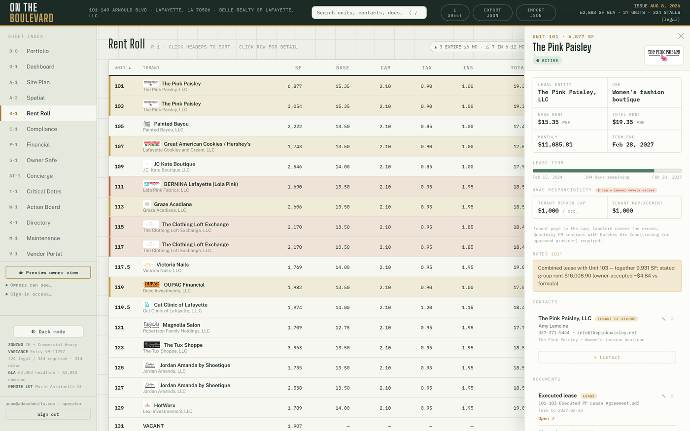

Click any unit anywhere (site plan, rent roll, 3D lens, satellite) and the
**drawer** opens with everything about that unit: term progress, PSF economics,
HVAC responsibility, notes, contacts, documents, photos, compliance rows, the
**Ledger** panel, and the **E-Sign** panel. Most day-to-day work happens here.

## 1.4 Search and shortcuts
- Press **/** anywhere → omni-search units, contacts, documents; Enter opens
  the top hit.
- **⤓ SHEET** (topbar) or **Ctrl+P** → prints the open sheet as a stamped PDF
  (drawing-set footer, date, headline figures). R-1 is guaranteed one page.
- **Export / Import** (topbar) → full state snapshot as JSON; Import restores
  it. This is your portable backup (§6.4).
- Theme toggle (sidebar foot): plan-room (default) ↔ dark. Print always
  reverts to paper.

## 1.5 Phones and tablets

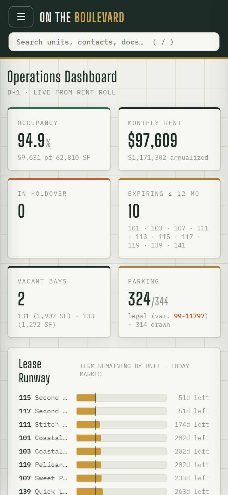 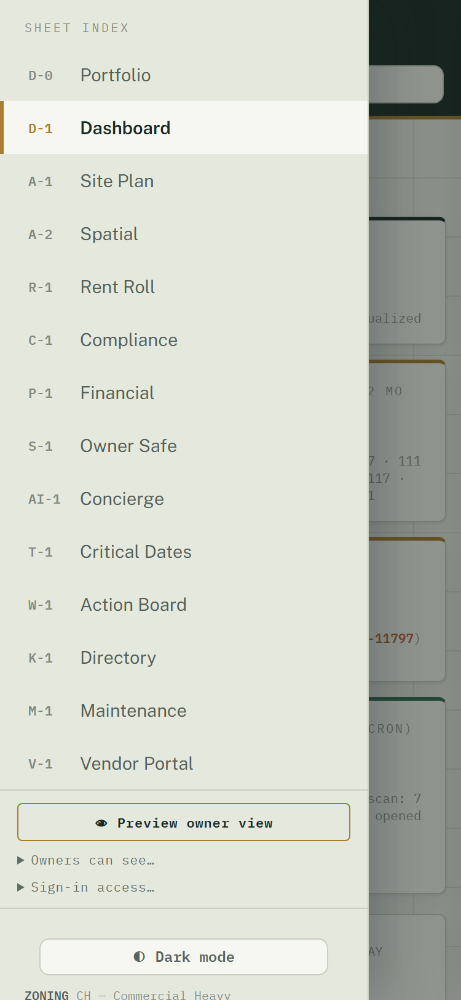

At phone widths the sheet index becomes an off-canvas drawer behind the ☰
button, grids collapse to one column, and the unit drawer goes full-screen.
Everything works; nothing is mobile-only.

---

# Part II — The operator's day

A normal day touches five surfaces:

1. **D-1 Dashboard** — scan the KPI row, the live cards, and the Action Queue
   (§3.2).
2. **W-1 Action Board** — the kanban seeds *itself* from live facts
   (holdovers, renewal windows ≤12 months, vacancies, compliance flags,
   covenant obligations, open work orders). Drag cards between lanes, dismiss
   what's handled, add custom cards. You never have to remember to create a
   card for a lease expiring — it appears on its own.
3. **AI-1 History** — the daily automated scan (11:00 UTC) may have opened a
   thread: a renewal window entered 180 days, a holdover appeared, occupancy
   dipped, the camera pipeline went quiet, a voice lead never booked, or a
   payment arrived that couldn't be matched. Each condition opens exactly
   **one** thread, ever — if there's nothing new, there's nothing there.
4. **M-1 Maintenance** — new tenant requests (from the portal or the phone
   line) appear in the queue. Triage per §3.10.
4a. **L-1 Comm Log** — the "Calls · 7 days" strip and the attention filter:
   every recorded phone call with its summary, intent and urgency chips;
   listen, read the turns, then **✓ Mark handled** (§3.19).
5. **Mail/phone → the system** — anything that arrived outside the system
   (a signed lease, a COI, a check conversation) gets recorded where it
   belongs the same day: SOT update (§5.3), vendor folder (§3.13), ledger
   entry (§3.11).

---

# Part III — Sheet-by-sheet instructions

## 3.1 D-0 Portfolio

One card per property you can see: A/R outstanding (sum of positive unit
balances over effective ledger entries) and open work orders, with an as-of
stamp. "Open →" switches the active property. With a single property the
**property switcher** stays hidden; at two or more it appears in the sidebar
(see the onboarding manual). Derived — nothing to maintain here.

## 3.2 D-1 Dashboard

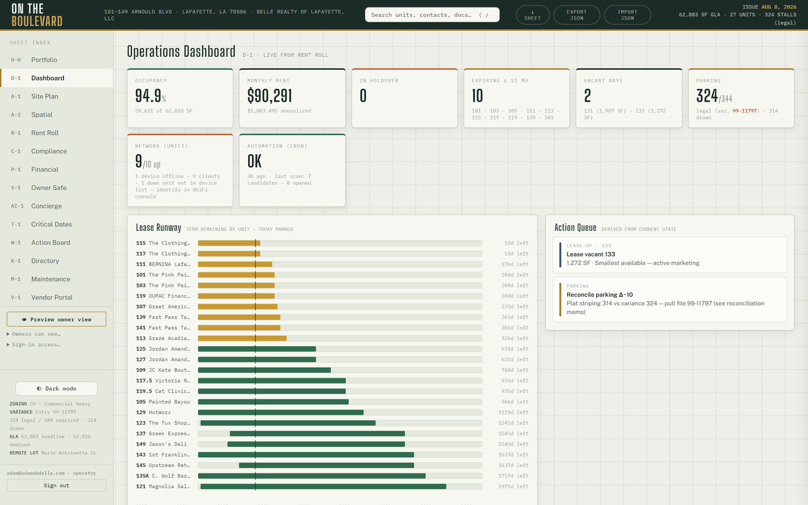

Read-only KPIs derived from live data — nothing to maintain here. Cards:
occupancy/rent KPIs, parking variance (from the instruments file, not typed),
**Parking Occupancy (C3)** with 7-day trend (48-hour freshness window; the
as-of label shows date+time for non-today samples), **Network (UniFi)**
up/down, **Automation (cron)** — green with last-run age; brick-red STALE past
26 hours, which matters because maintenance aging, voice leads, C3 heartbeat,
UniFi, rent posting, and the owner brief all ride that one daily cron —
**Client Errors (24h)** (renders only when the count is nonzero), the
**Calls** KPI (recorded voice calls awaiting attention), and the
Action Queue (same cards as W-1). If a card shows brick-red, it is telling you
something needs attention.

## 3.3 A-1 Site Plan

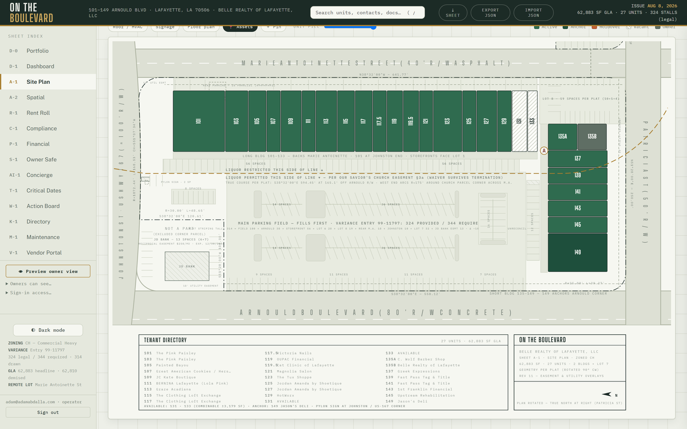

The recorded plat, interactive. A **View** row above the chips sets a preset
— Leasing · Daily Ops · Building Systems · Common Areas · Signage · Roof ·
Site / Hardscape — and the chips re-derive from it; toggling any chip by hand
drops the preset highlight. **Chips** toggle overlay layers:
- **Lenses:** Status / Expiry / Rent / Use / HVAC / Size — unit fills + legend.
- **🅿 Parking** — the 314 plat-labeled stalls by zone, plus the 10-stall Johnston
  row the CAD stripes but the plat never labels (marked as such).
- **⇆ Access** — ingress/egress as built: every curb cut drawn as an apron with its
  throat width, two-way arrow pairs at the cuts and along the aisles, the Arnould
  raised median and its one 55' opening (Driveway A is the only full-movement cut),
  edge-of-pavement lines, Lot 7's open Patricia frontage. Source: the architect CAD,
  satellite-confirmed (`docs/site-access-inventory-2026-09.md`).
- **§ Easements** — the §3a liquor line and its notes, the church easement note,
  10' utility easements, electric easement 577566, the 5×5' guy easement. Switch off
  for a clean leasing exhibit.
- **🎥 Cameras** — 17 mounts with view cones; click one → its live view.
  **✎ Adjust cams** (operator-only): drag pin to move, drag the brass dot to
  re-aim, double-click to reset; corrections persist.
- **🚗 Occupancy** — latest measured stall states painted green/outline over
  the storefront row, Lot 8 pocket, and the 149 corner.
- **📍 Pins / ＋ Pin** — drop a pin per water shutoff, meter, bench, column — and
  for lease/ops designations: reserved parking, monument-sign site, common area,
  loading zone, dumpster pad. Pins also appear on the satellite lens.
- **Overlay → Floor plan** — whole-center floor-plan raster under the unit
  boxes, with an opacity slider.
Click any unit → drawer.

## 3.4 A-2 Spatial (four lenses)

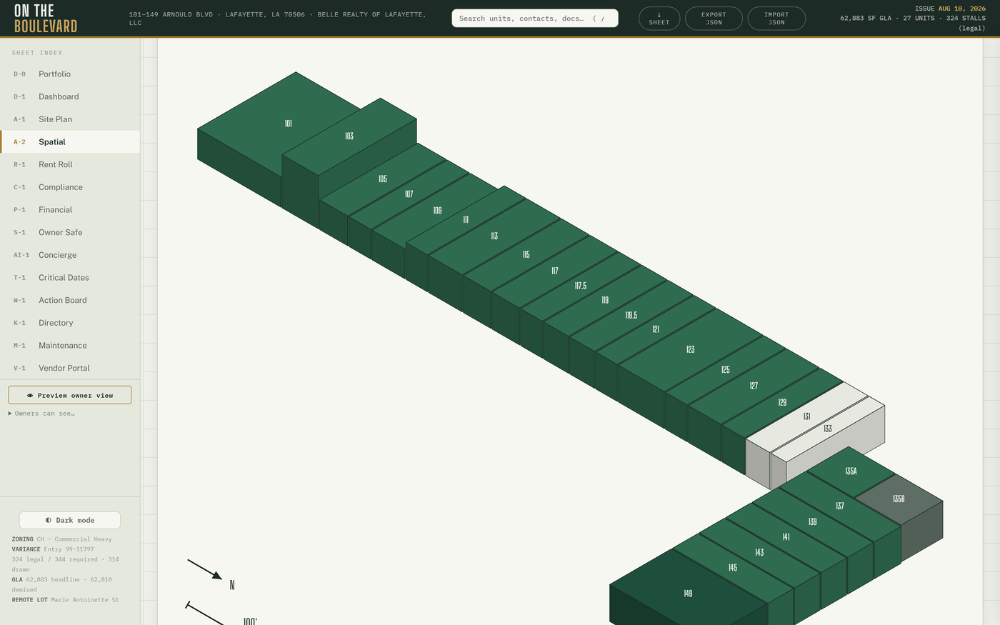

- **Iso** — SVG isometric, real CAD heights; ⇅ toggles true heights;
  ⤓ SVG exports a standalone file.
- **◧ 3D** — orbitable massing; **🏗 Mesh** swaps in the photogrammetry mesh.
- **🛰 Satellite** — frozen basemap with georeferenced footprints, unit
  labels, asset pins; opens plan-oriented (Marie Antoinette top).
- **🎥 Reality** — photoreal drone splat; ▦ toggles unit overlays; click a
  storefront → drawer.
All lenses share the same selection — pick a unit in one, it's selected in all.

## 3.5 R-1 Rent Roll

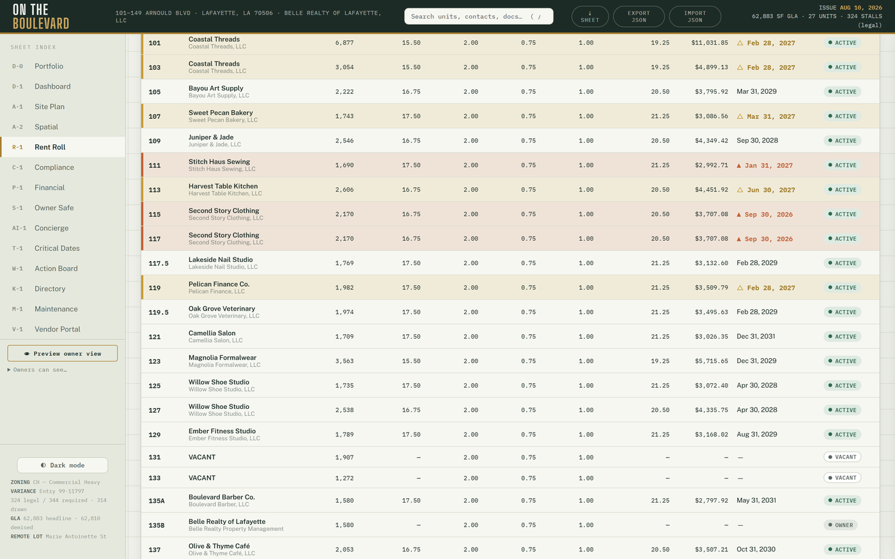

11 sortable columns; any bare monthly amount is **TOTAL rent** (base +
additional). The PSF breakdown chart is the only place component economics
(Base · CAM · Tax · Ins) appear — by design.
**⤓ SHEET** prints the owner one-pager: guaranteed one page (the layout
measures itself and shrinks to fit), with expiry flags — ▲ brick ≤6 months,
△ amber 6–12 months — and a legend in the stamp.

## 3.6 P-1 Financial

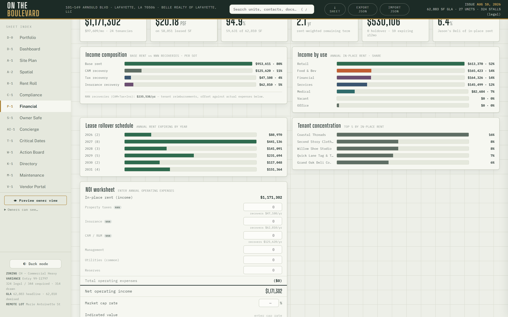

Income composition (bars + a composition donut beside the Base · CAM · Tax ·
Ins breakdown), rollover, and concentration charts; the **NOI worksheet**
(enter opex → NOI → cap-rate value) now opens with a **revenue → NOI
waterfall** (gross potential rent + vacancy are labeled ESTIMATES at the
effective PSF; expense steps are your worksheet lines only) and a **cap-rate
sensitivity** table ±100 bp in 25 bp steps around the entered rate (or the
flagged 8.50% appraisal reference when blank — never stored);
**Collections & aging** (month collected-vs-charged, collections history bars,
and per-unit FIFO aging from the ledger); **Tenant health** — five tiles plus
a worst-first list with OK / Watch / At-risk chips and a "How this score is
calculated" fold (score model 60/25/15; rows open the drawer; hosted only);
and the **CAM reconciliation** card — year picker, prior-year opex worksheet,
per-tenant caps from the lease abstracts (`src/data/recovery-terms.json`),
derived occupancy gross-up, and a per-row **⤓ Statement** that prints the
tenant's annual reconciliation with the PSF breakdown, cap line and
methodology. Suites with unknown PSF print "Not determinable" rather than a
guess. The Excel proforma (`npm run proforma`) is the owner-overridable model
for underwriting conversations.

## 3.7 C-1 Compliance

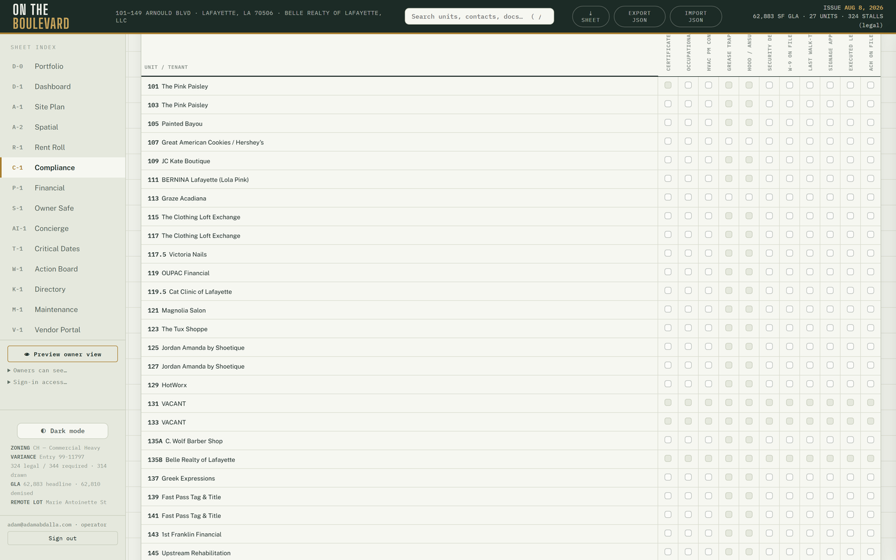

A **Document coverage** card sits above the matrix: per occupied suite —
Lease · COI · COI expires · other documents — with filter chips and five
summary counts. Evidence = a file on the suite's document records OR a matrix
"On file"; a matrix Flag is a gap. Then the 11×27 matrix. **Click a cell to cycle** unknown → ok → flag → n/a
(food-service-only fields apply only where relevant). Every flip is recorded —
who, when, from→to — and **⏱ History** shows the trail. You cannot corrupt
this history; corrections are new flips. Edits sync live between devices —
flip a cell on your phone and it flips on the desktop without a reload.

## 3.8 T-1 Critical Dates

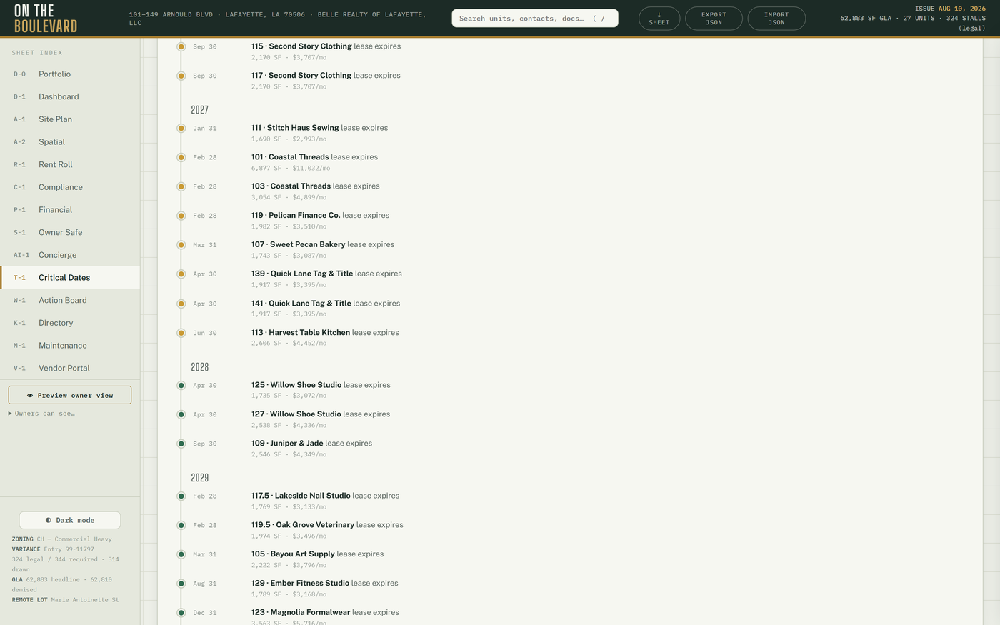

Three derived views — nothing to maintain:
- **Lease expiry timeline** — a four-year Gantt with a today line and bucket
  cards (past end · <90 d · 90–180 d · >180 d · term unresolved). Suites whose
  lease end is unresolved in the September 2026 lease review list under
  "term unresolved" with their review label — BY DESIGN, never guessed.
  Row click → drawer.
- **Renewal pipeline** — option terms transcribed from the executed leases
  (`src/data/renewal-options.json`, reference only; every notice = 60 days).
  Groups: Notice window · Deadline passed · Option available · Term
  unresolved. "Open suite" → drawer.
- **Instrument + governance deadlines** — the JD Bank servitude end, the
  insurance renewals, the premium-finance maturity, and every S-1 governance
  item with a date, on the same timeline as the leases.

## 3.9 W-1 Action Board

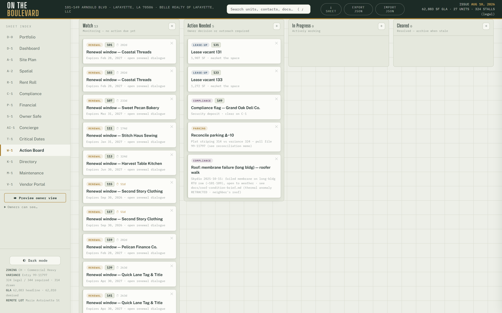

See Part II. A **leasing pipeline strip** over the deals table (inquiry →
tour → proposal → signed; voice and web leads land here on their own) sits
above the lanes. Card types include seeded facts (holdover, renewal, vacancy,
compliance flag, covenant) and **live work-order cards** (`mr:` prefixed).
Overrides (lane moves, dismissals) persist; the seed recomputes every render,
so a dismissed card returns only if the underlying fact returns.

## 3.10 M-1 Maintenance (operator face)

- **Queue:** every request with status, age, unit, photos.
- **Assign:** pick a vendor from the service roster → the vendor sees it in
  V-1 immediately.
- **Status flips** and notes are append-only events.
- **Tenant logins:** the roster editor (email ↔ unit) controls who may sign in
  as a tenant. Add email + unit; they magic-link in like everyone else.
- **File on behalf:** log a phone-in request yourself.
- **Aging alarm:** unassigned requests older than 2 days (1 for emergencies)
  open a manager thread automatically.
Tenant-side view: §4.3.

## 3.11 The Ledger (drawer → Ledger)
- Balance headline + last entries with running balance.
- **⤓ Statement** — a branded, printable tenant statement (owner-visible).
- **Prior payments** — 13 months of payment history with status-truth
  lateness (the July 2026 rows imported from Asset Command were bulk-entered;
  never trust their paid-at dates).
- **Lease abstract** (operator-only panel) — the abstracted terms, escalation
  steps and option terms for the suite, beside the ledger.
- **Monthly rent charges post themselves** (idempotently) on the 1st, since
  August 2026.
- **ACH payments post themselves.** Each unit has a reusable Stripe payment
  link (ACH only; roster with URLs: `docs/stripe-payment-links-2026-08.md`,
  copy on Drive). You send the link through your own channel — the app sends
  nothing. When the payment settles (ACH takes days), the unit's ledger gains
  an `ach:<payment-intent-id>` entry automatically. A payment that can't be
  matched to a unit, or that fails, opens a manager thread in AI-1
  (`ach-unmapped:` / `ach-fail:`) instead of landing silently.
- **"Payment received"** records an out-of-band payment by hand.
- Add charge / credit / adjustment / NSF / write-off as needed.
- **Void** = ✕ on an entry → creates a *reversing entry* (nothing is deleted).
- **Late-fee chips:** past the 5-day grace, a suggestion chip appears
  ($100 + $25/day, the standard schedule). It posts **only when you confirm.**
  If a lease carries different late terms, flag it — policy goes per-unit.
- **Amount changes:** re-run `tools/stripe-payment-links.mjs` for that unit
  and retire the old link in the Stripe dashboard.

## 3.12 The E-Sign panel (drawer → E-Sign)
1. **Create** a request (optionally attach a document for review).
2. **Copy link / Copy message** — the app sends nothing; you deliver the link
   through your own channel (text/email). This is deliberate.
3. The signer opens a plain, branded page — no login needed — reviews, and
   signs or declines (E-SIGN/LA-UETA consent language included).
4. You see the live status (sent → viewed → signed/declined/expired), can
   **re-token** (invalidate + reissue) or **cancel**, and get a signed receipt.
Tokens are single-lifecycle: double-signing or declining after signing is
rejected by the database itself.

## 3.13 V-1 Vendor Portal (operator face)

- Roster (service vendors first, green "portal" tag = they can sign in).
- Per-vendor private folder: upload / open / delete, all audited.
- **COI tracking:** set expiry + note per vendor → badge auto-classifies
  (expired / ≤30d / ≤60d / ok; missing is flagged for service vendors).
- **🤖 Parse cert:** drop an ACORD PDF → AI pre-fills carrier, limits, expiry,
  and a normalized note → review → **Save COI**. Always review before saving.
- Assigned work orders appear on the vendor's face automatically (§4.2).
- **Inviting a vendor** = telling them to magic-link in with their roster
  email. Nothing else to configure.
- Policy: COI / W-9 / license are verified at **payment**, not dispatch.

## 3.14 K-1 Directory

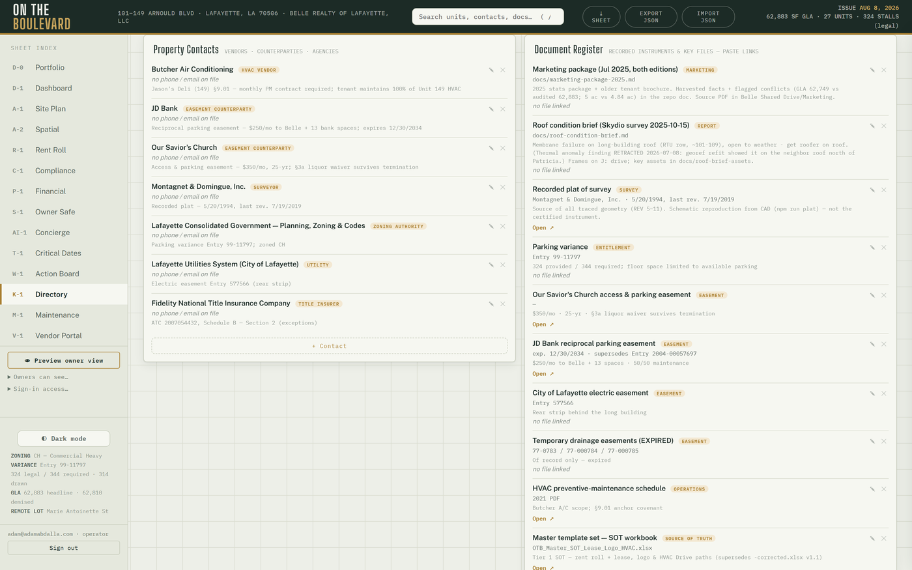

Property contacts (including the **Property lines** block — the tenant and
leasing numbers — and the insurance contacts: agent, brokers, claims lines),
the document register, and the site-imagery library. Register rows carry
`counterparty · amount · effective · matures · status · risk` besides the
file (📎 attach → the row's link becomes an "Open 📎" that always serves a
fresh secure URL); an **expiring strip** at the top lists what lapses next.
The **pylon sign** renders as a native SVG elevation next to the tenant
roster — hover links panel ↔ row, click → drawer; installed-but-unlisted
faces draw brick-dashed.

## 3.15 S-1 Owner Safe

Opens with **Property records**: a **Risk register** (worst-first) and a
**Renewal & maturity radar** (soonest-first) derived from the document
register — today that is the 2026–27 insurance program as bound (property ·
BOP liability + umbrella · workers' compensation, all renewing 2027-05-15, the
premium-finance agreement maturing 2027-03-15), the loan maturity, the lender
title policy and the recorded instruments. Abstract of the bound policies:
`docs/insurance-program-2026-27.md`. Then the **Governance** block (items with
deadlines feed T-1), **⤓ Board report** (quarterly, assembled from the stored
owner briefs), and the category folders (Proforma / Leases / Tax / Insurance /
Banking / Other). Upload and open as the operator; owners read-only;
vendors/tenants sealed out at the database layer. **Recent access**
(operator-only) shows every view, upload, and delete with who and when.

## 3.16 AI-1 Agent Desk

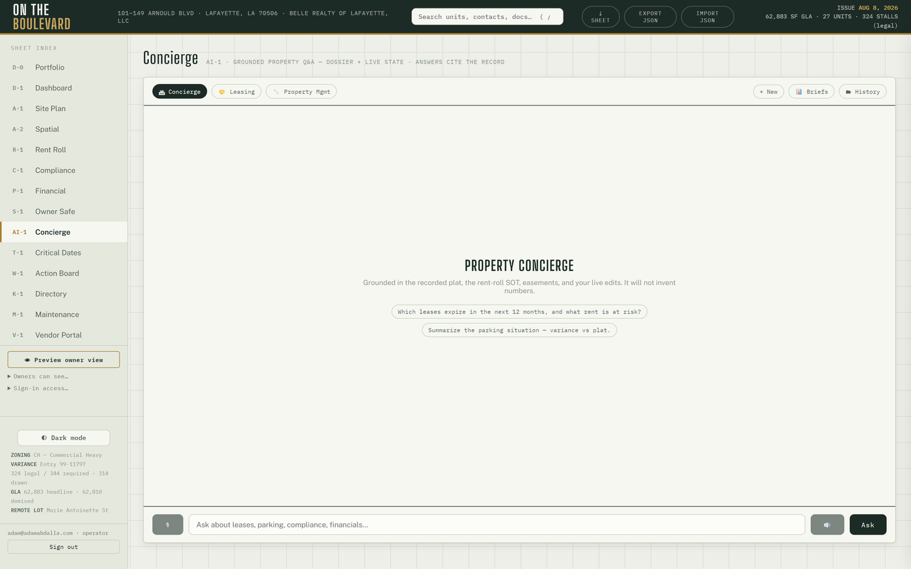

Three personas — **🏛 Concierge** (property Q&A), **🤝 Leasing**,
**🔧 Property Manager** — all grounded in the property dossier + live state.
- Conversations persist and resume after reload; **🗂 History** reopens any
  thread; **＋ New** starts fresh.
- **🎙** mic input and **🔊** spoken replies (Chrome/Edge).
- **Numbers are guardrailed:** once a calculation is involved, every figure in
  the reply must trace to the deterministic engines or the reply is replaced
  with the engines' own summary. Ask the leasing agent things like
  *"compare retaining at $17 vs replacing at $20 with 3 months free and $10
  TI, 5-yr term, 1,917 SF, 7.5% cap"* — or the manager
  *"should I spend $45K on an RTU replacement with a $120K reserve, $30K/yr
  contributions, installed 2008, 15-yr life?"*
- **📊 Briefs** — the monthly owner-brief archive; Open 🔒 renders any month.
- **📦 Lead SMS** (leasing persona): copies a ready-to-send text with the
  public leasing one-pager (otb.cypresscommand.com/leasing.html) and the
  leasing line number. You paste and send it — the app sends nothing.
- **Lease packages (operator-only):** ask 🤝 Leasing to assemble a proposal;
  it collects terms conversationally, then generates a branded DRAFT proposal
  (and optionally the internal owner summary) as a card with **Open 🔒** and
  **✉ Email** (pre-filled mailto — you send it; it never auto-sends).
  Every generated document is DRAFT-stamped, subject to legal review.

## 3.17 The voice lines (LIVE)
- **Tenant line (337) 273-0384:** 24/7; triages per the SOP (emergencies =
  leak / electrical / break-in / sewer → dispatch + notify after-hours, never
  wakes you for permission); files real work orders into M-1; never discusses
  eviction timelines.
- **Leasing line (337) 270-7044:** takes name + number, quotes the approved
  rate range only, screens against exclusive-use conflicts, books tour slots
  (18h lead, Tue/Thu defaults; double-booking is impossible). **Truthful
  booking is enforced:** the agent cannot claim a tour is booked unless the
  booking tool actually succeeded; an unbacked claim is corrected or replaced
  with an honest fallback, and a leasing call that ends without a booking
  opens a `voice-lead:` manager thread within hours so no lead drops.
- Both greetings end "This call may be recorded." Every call is recorded at
  Twilio (once the Twilio account variables are set in Vercel), summarized
  the moment it ends (intent · urgency · unit · caller · callback · follow-up
  — nothing invented; hang-ups still record), written to **L-1** as a call
  card with the Caller/Agent turns and ▶ Play recording, mirrored as a
  transcript thread in AI-1 History, and e-mailed to the owners when a mail
  key is configured. Emergencies open a manager thread on their own.
- The leasing line can **send the leasing package** by e-mail (and by text
  once A2P messaging is approved): the caller's request creates a deal row
  and the agent may only claim the legs that actually went out.
- Calls that end before the summary lands are swept by the daily cron
  (≥20 minutes unfinalized) so nothing is lost.
- Go-live steps + secret rotation drill: `docs/a3-voice-runbook.md`; call
  records: `docs/voice-call-records-runbook-2026-09-18.md`.

## 3.18 B-1 Marketing

Five blocks, every one generated from the source of truth on the fly — a
flyer can never disagree with the rent roll, and **rates are never printed**:
1. **Availability flyers** — one printable flyer per vacant suite.
2. **Center overview** — stats · logo wall · site plan · availability.
3. **Tenant cards** — 1080-square co-marketing card per tenant.
4. **Photo library** — the assets bucket by suite; the operator picks the
   hero image per suite and the pick persists (`marketing` layer).
5. **360° tour media** — panoramas + hero stills uploaded to the PUBLIC
   `tour` bucket; **Publish manifest** refreshes what the /tour microsite
   shows. Insta360 export settings and the upload steps:
   `docs/marketing-b1-and-tour-2026-09-18.md`.
Every output opens as a page with Print / Save PDF. The **pylon sign** block
shows the sign, its roster and "tenants without a face" per tenant. QR codes
for the leasing page and the tour live in `public/qr/`.

## 3.19 L-1 Comm Log

The cross-channel correspondence sheet. Filter by channel (note / e-mail /
letter / meeting / SMS / voice / web) or unit, search, expand an entry,
hand-log new correspondence, delete stale rows. **Voice rows** (§3.17) carry
intent and urgency chips, a needs-attention dot, the summary, outcome links
(work order · tour · lead · package), ▶ Play recording, the Caller/Agent
turns, and **✓ Mark handled**. The "Calls · 7 days" strip and the attention
filter are the morning triage (Part II). Web tour requests from /tour land
here too. Owners see the log read-only, including every call's summary,
transcript and recording; tenants and vendors never see this sheet.

## 3.20 N-1 Matters & Planning

Long-running property affairs as status-filtered cards: kind (lease
negotiation, claim, permit, dispute, project, general), status, deadlines,
correspondence and file attachments. Operator: open a matter, edit fields
inline, log meeting notes (they mirror into L-1), attach documents (they ride
the documents bucket), close or reopen. Deadlines feed T-1. Owners read the
cards and open attachments but never attach.

## 3.21 O-1 Operations

The procedures (SOP) library — categories → procedures → steps, with
due-today / overdue / streak state. Browse, expand a procedure, ✓ **Complete**
with notes and minutes (it closes the oldest open occurrence), author new
content (add or edit categories, procedures, steps; deactivate), clear stale
occurrences. The daily cron materializes each scheduled procedure's current
occurrence and opens ONE "SOPs overdue" digest thread in AI-1 keyed by the
newest lapse (a static backlog never re-fires). Owners read-only; tenants and
vendors never see O-1.

## 3.22 The public /tour microsite

`otb.cypresscommand.com/tour` needs no sign-in: a 360° viewer per suite when
panoramas have been published from B-1, otherwise the plat, the numbers and
Call / Text-to-tour. The **Request a tour** form writes a web lead (deal row +
L-1 note, capped per day), opens a manager thread in AI-1, and e-mails the
owners when mail is configured. The leasing one-pager stays at
`/leasing.html`.

---

# Part IV — Counterparty guides

## 4.1 Owners
Sign in with your authorized email (the owner list is fixed by the operator —
§6.1). You see the sheets the operator has shared (dashboard, rent roll,
financials, and the Safe are typical), **read-only**. The Comm Log, when
shared, lets you listen to any recorded call and read its summary and
transcript.
The **📊 Briefs** panel in AI-1 holds your monthly intelligence brief — every
figure deterministic, archived permanently. You may ask the AI desk questions;
its numbers are guardrailed the same as the operator's.

## 4.2 Vendors
Magic-link in with the email the operator has on file. You see one sheet: your
own folder (your documents + "send a file to management"), your COI status
with a renewal nudge, and **your assigned work orders** — open each to read
notes and photos, add notes, and **✓ Mark complete** when done.

## 4.3 Tenants
Magic-link in with the email your management added. You see M-1 for **your
unit only**: file a maintenance request (describe the problem, attach photos),
watch its status, and **"Your account"** — your current balance and recent
ledger entries. Rent is paid through the payment link management sends you —
one link per unit, reusable every month. Emergencies (water leak, electrical
hazard, break-in, sewer): call the maintenance line rather than filing a
ticket.

## 4.4 Document signers
You'll receive a link from management. It opens a simple page — no account,
no app. Review the request (and the attached document if one is linked), then
sign or decline. The signature is recorded with timestamp and consent language
under the federal E-SIGN Act and Louisiana UETA.

---

# Part V — Rhythms

## 5.1 Daily (mostly automatic)
- 11:00 UTC — proactive scan: renewals/holdovers/occupancy → AI threads;
  work-order aging; camera-pipeline heartbeat; rent-charge posting;
  unmatched-ACH threads; unbooked voice leads; UniFi outages; unfinalized
  voice calls swept into L-1; scheduled procedures materialized on O-1 and
  ONE "SOPs overdue" digest thread. The scan also
  stamps the **Automation (cron)** card on D-1 — if that card goes brick,
  every one of those safety nets is silent; treat it as urgent.
- 12:00 local + 23:45 local — camera frames classified + uploaded
  (hands-free; the sampler is watchdog-healed).
- You: the Part II walk — dashboard, board, AI history, maintenance queue.

## 5.2 Monthly
- **1st:** Owner Intelligence Brief generates itself; rent charges post
  themselves. Skim the brief before the owner does.
- Send (or re-send) payment links through your channel; ACH payments post
  themselves as they settle; confirm or dismiss late-fee chips after the
  grace window.
- Documented property walk (per SOP); update C-1 flags as found — the history
  logs itself.

## 5.3 When a lease is signed / a fact changes (governed SOT update)
1. Update the source of truth: `docs/lease-population-2026-09-10.md` and the
   suite's `leaseEvidence` in `src/data/units.json` (Tier 1 since the
   September 2026 lease review; `docs/sot-2026-07/` stays authoritative for
   suites the review does not name). Supersession rules:
   `docs/sot-supersession-2026-09-11.md`.
2. Apply the change to `src/data/units.json`. Leave a lease `end` BLANK when
   the signed documents do not resolve it — T-1 and W-1 then show "term
   unresolved" instead of a guessed date. No holdovers are assumed.
3. `npm run split-seed` && `npm run concierge-context` (the test suite fails
   if you forget — deliberately).
4. `npm test` → commit → deploy (§6.3) → verify live.
Never trust an imported system's dates over signed paper; store stated-rent
exceptions as exceptions — do not "fix" them to formula.

## 5.4 Periodic
- COI badges: chase at ≤60 days, escalate at ≤30 (§3.13).
- Semi-annual house HVAC PM (the anchor unit is excluded — its lease requires
  the tenant to maintain its own HVAC with the designated contractor).
- Move-out: solo walk + photos within 30 days; file to the unit's assets.
- Re-run marketing artifacts when availability changes (`npm run poster`,
  leasing one-pager per `tools/leasing-package.py`).

---

# Part VI — Administration & recovery

## 6.1 Granting and revoking access
- **Owner:** sidebar → "Sign-in access…" → type email → **+ Owner**. Their
  first magic link lands them as owner. Anyone stuck in pending is listed
  there with one-click "make owner". Revoke = ✕ (removes pre-authorization;
  demoting an existing profile is a Supabase console step).
- **Vendor:** ensure their email is on the roster; tell them to sign in.
- **Tenant:** M-1 → Tenant logins → add email + unit. Remove the row to cut
  access.
- **Owner sheet visibility:** the "Owners can see…" panel controls which
  sheets owners get.

## 6.2 Quality gates (never skip)
`node --check` on changed modules · `npm test` (777) · `npm run build` ·
deploy · **grep the prod bundle for the change** · smoke the live URL.
Since 2026-09-11 **every push to `master` deploys** through
`.github/workflows/deploy.yml` (npm ci → npm test → vercel build/deploy
--prod); a failing test blocks the deploy. Verify by fetching the live page
and checking the `assets/main-<hash>.js` bundle name against the local build.

## 6.3 Deploying
Push to `master` (or merge a PR) — GitHub Actions deploys production. Manual
fallback from this machine:
```bash
npx vercel deploy --prod --yes --scope adams-projects-0c52918e
```
(`.vercelignore` governs uploads — the 16MB splat + 3MB mesh ride in
`public/`.) Never promote a Preview deployment: previews run against the
isolated Supabase branch and the build aborts if production secrets leak into
the Preview scope.

## 6.4 Backup & portability
- Topbar **Export** → full-state JSON. Take one before risky edits; **Import**
  restores.
- The repo is the authoritative system; all exports (dossier, buyer set,
  posters) are disposable and regenerable. Every export also lands on
  `G:\My Drive\00 OTB\`.
- A scheduled task (`OTB-Repo-Backup`, daily 03:00) bundles full git history
  to Drive. Committed-only — commit anything that matters.
- Local preview without login: dev server on port **5199**; move `.env` aside
  temporarily — and restore it after. (Confidential rents do not render in
  that mode — by design.)

## 6.5 Secrets
Keys live **only** in Vercel env — never in chat, repo, or disk. Rotations are
scripted drills: `tools/rotate-secret.mjs` (shared cron secret),
`tools/rotate-voice-secret.mjs` (voice). One-shot key needs (e.g. the
restricted Stripe key used to mint payment links) follow the drop-use-delete
drill: key to a dotfile, tool consumes it, file deleted — never in chat.
Vercel rejects env values with trailing whitespace at deploy time — the
scripts handle this; when feeding a secret to a CLI, use `cmd /c "… < file"`
(PowerShell pipes append a newline).

## 6.6 The camera (C3) pipeline
Fully hands-free: sampler (5-min ticks, watchdog task self-heals it at logon
+ every 5 min) → midday 12:00 + nightly 23:45 classify + upload → app
surfaces. If it goes quiet 36 hours, a manager thread opens on its own. After
a machine reboot the watchdog relaunches the sampler; no manual step. Known
conventions: capture day-directories are UTC-keyed; frames live outside the
repo.

## 6.7 Known limits (deliberate v1 boundaries)
- E-sign, lease proposals, and payment links: the operator transmits
  links/documents; the app sends nothing outbound on its own.
- Voice: no SMS notify on dispatch, no live call transfer, no daily call cap
  (set a Twilio usage trigger); recordings and the leasing-package e-mail
  wait on the Twilio and mail keys in Vercel; the leasing package by text
  waits on A2P approval; settings edits via SQL until a UI lands.
- B-1 outputs and the /tour site never print a rate; the operator quotes
  rates in person or by the leasing line's approved range.
- Desktop-first; the phone experience is a responsive web app, not a native
  app.
- Onboarding a second property is operator-driven (see the onboarding
  manual); there is no self-serve signup.

---

*Questions the manual doesn't answer: ask the 🏛 Concierge — it is grounded in
the same governed data this manual describes.*
